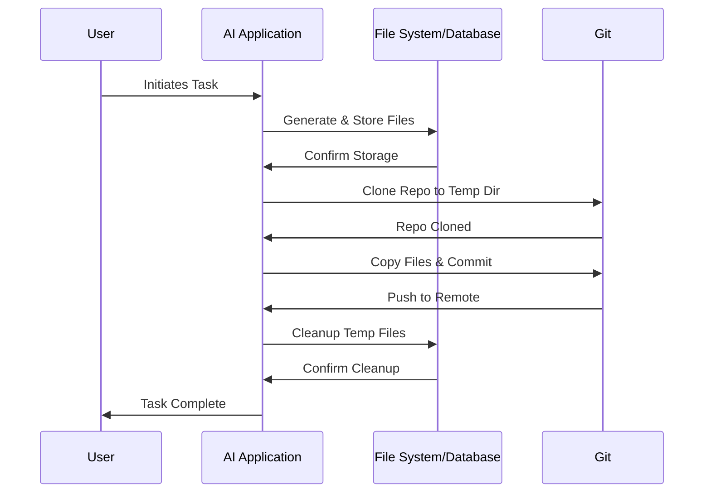

# Crash Course: Handling File Generation and Temporary Storage in AI Applications

## 1. Overview

This report provides a concise guide on handling file generation and temporary storage in an AI application. It covers the basic workflow from file creation to organization and temporary storage, assuming the use of common services and tools, including Git for version control.

## 2. File Generation

- The application generates the required files (code, configuration, etc.) based on AI outputs or user inputs.
- Generated files are temporarily stored either in the server's file system or in a database.

## 3. Temporary Storage

- Each user session or task gets a unique temporary directory to avoid conflicts and maintain data isolation. This can be stored either on cloud storage like S3 buckets or in the MongoDB.
- Files are stored in these directories during the session.

## 4. File Organization

- Files are organized in the same folder structure that mirrors their intended arrangement in the repository.
- This organization is crucial for ease of management and later stages of version control.

## 5. Version Control Integration

- A Git client library is used for cloning, committing, and pushing changes to the repository.
- The process involves cloning the repository to the temporary location, copying the generated files, and executing Git operations.

## 6. Cleanup

- Temporary files and directories are cleaned up post-task completion or after a set duration.

## 7. Mermaid Sequence Diagram

Here's a sequence diagram illustrating the process:

