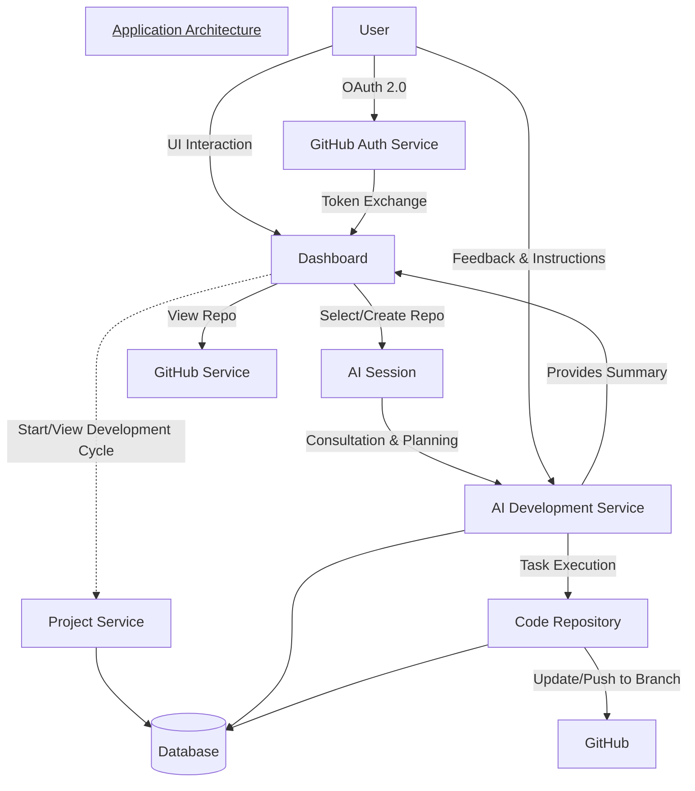
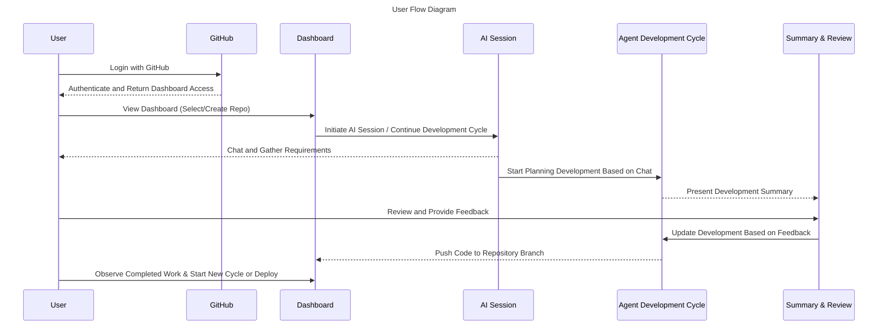
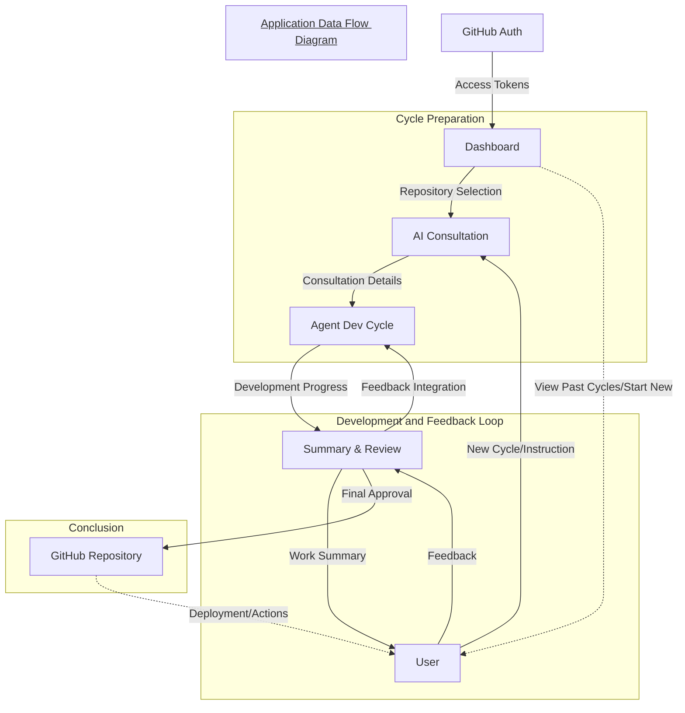
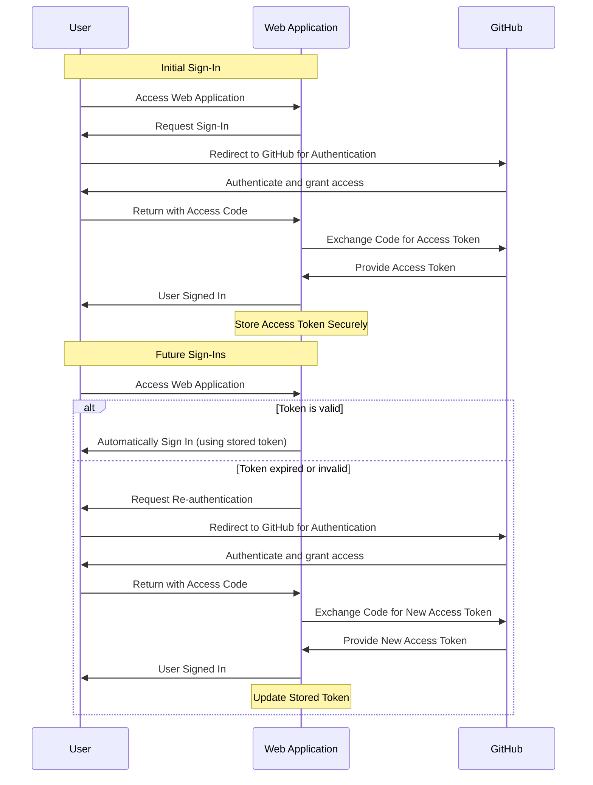

# System Diagrams

# Backend Application Architecture

---

```mermaid
graph TB
    title[<u>Application Architecture</u>]
    
    user[User] -->|OAuth 2.0| auth[GitHub Auth Service]
    user -->|UI Interaction| dashboard[Dashboard]
    auth -->|Token Exchange| dashboard
    dashboard -->|Select/Create Repo| aiSession[AI Session]
    dashboard -->|View Repo| ghService[GitHub Service]
    dashboard -.->|Start/View Development Cycle| projectService[Project Service]
    aiSession -->|Consultation & Planning| aiService[AI Development Service]
    aiService -->|Task Execution| codeRepo[Code Repository]
    aiService -->|Provides Summary| dashboard
    user -->|Feedback & Instructions| aiService
    projectService --> db[(Database)]
    aiService --> db[(Database)]
    codeRepo --> db[(Database)]
    codeRepo -->|Update/Push to Branch| github[GitHub]
```

# ****User Flow Diagram****

---

```mermaid
sequenceDiagram
		title User Flow Diagram
    participant U as User
    participant GH as GitHub
    participant DB as Dashboard
    participant AI as AI Session
    participant ADC as Agent Development Cycle
    participant SR as Summary & Review

    U->>GH: Login with GitHub
    GH-->>U: Authenticate and Return Dashboard Access
    U->>DB: View Dashboard (Select/Create Repo)
    DB->>AI: Initiate AI Session / Continue Development Cycle
    AI-->>U: Chat and Gather Requirements
    AI->>ADC: Start Planning Development Based on Chat
    ADC-->>SR: Present Development Summary
    U->>SR: Review and Provide Feedback
    SR->>ADC: Update Development Based on Feedback
    ADC-->>DB: Push Code to Repository Branch
    U->>DB: Observe Completed Work & Start New Cycle or Deploy
```

# Application Data Flow

---

```mermaid
graph TD
    title[<u>Application Data Flow Diagram</u>]

    AUTH[GitHub Auth] -- Access Tokens --> DB[Dashboard]
    
    subgraph Cycle Preparation
    DB -- Repository Selection --> AI[AI Consultation]
    AI -- Consultation Details --> ADC[Agent Dev Cycle]
    end
    
    subgraph Development and Feedback Loop
    ADC -->|Development Progress| SR[Summary & Review]
    SR -->|Work Summary| U[User]
    U -->|Feedback| SR
    SR -->|Feedback Integration| ADC
    end
    
    subgraph Conclusion
    SR -->|Final Approval| REPO[GitHub Repository]
    U -->|New Cycle/Instruction| AI
    end
    
    DB -.->|View Past Cycles/Start New| U
    REPO -.->|Deployment/Actions| U
```

# Sign in with Github (OAuth Flow)

---

```mermaid
sequenceDiagram
participant U as User
participant W as Web Application
participant G as GitHub

Note over U,W: Initial Sign-In
U->>W: Access Web Application
W->>U: Request Sign-In
U->>G: Redirect to GitHub for Authentication
G->>U: Authenticate and grant access
U->>W: Return with Access Code
W->>G: Exchange Code for Access Token
G->>W: Provide Access Token
W->>U: User Signed In

Note over W: Store Access Token Securely

Note over U,W: Future Sign-Ins
U->>W: Access Web Application
alt Token is valid
    W->>U: Automatically Sign In (using stored token)
else Token expired or invalid
    W->>U: Request Re-authentication
    U->>G: Redirect to GitHub for Authentication
    G->>U: Authenticate and grant access
    U->>W: Return with Access Code
    W->>G: Exchange Code for New Access Token
    G->>W: Provide New Access Token
    W->>U: User Signed In
    Note over W: Update Stored Token
end
```